# Number Click Game

[Link to a live site](https://petrokuida.github.io/number-click-game/)

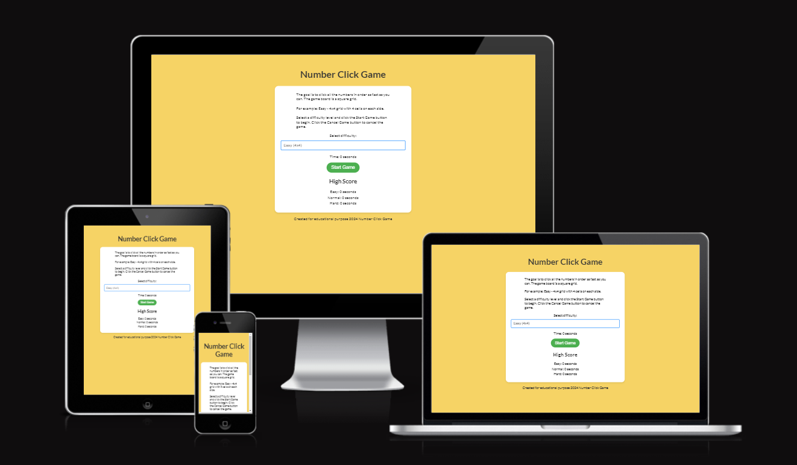

## Introduction

The Number Click Game is an interactive and engaging game designed to test players' speed and precision. The objective is to click all the numbers in ascending order as quickly as possible. The game offers various difficulty levels that change the grid size, making it suitable for players of all ages and skill levels. Whether you're a casual gamer or a competitive player, the Number Click Game provides a fun challenge to improve your reaction time and number recognition skills.

### Features

#### Game Board:
- The game board dynamically adjusts its size based on the selected difficulty level.
- Players can choose between Easy (4x4), Normal (5x5), and Hard (6x6) grids.

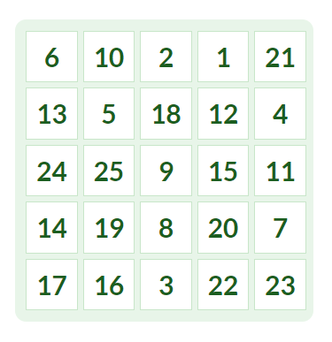

#### Timer Display:
- A timer tracks how long it takes for players to complete the game, adding a competitive element.

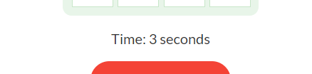

#### High Score Tracking:
- The game saves the best times for each difficulty level using local storage, allowing players to challenge their previous records.

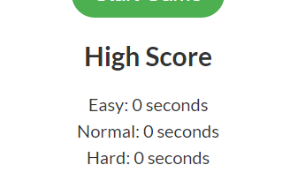

#### Buttons:
- The game includes "Start Game" and "Cancel Game" buttons for easy gameplay control.

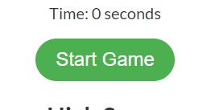
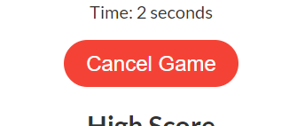

## Testing

### Bugs  
**Issue 001**  
Incorrect timer display when game is canceled.  
**Resolution**: Reset timer value to zero when the game is canceled.  

**Issue 002**  
Game board not updating correctly on difficulty change.  
**Resolution**: Reset game board upon starting a new game.

**Issue 003**
Cell color stays red after double-clicking a number faster than the timer can update.
**Resolution**: Decrese the timer interval to 100ms.

### Unresolved Bugs
- No unresolved bugs at this time.

### Manual Testing
- **Game Board**:
    - Verified that the game board dynamically changes based on selected difficulty.
    - Ensured all numbers display correctly.

- **Timer**:
    - Confirmed timer starts and stops as intended.

- **High Score**:
    - Checked that best times are saved and displayed correctly.

#### Devices Used During Testing:
- Desktop Computer
- Android Mobile Device
- Chrome DevTools Emulator

### Browser Testing
The game was tested primarily on Google Chrome, with additional testing on:
- Mozilla Firefox
- Microsoft Edge
- Safari

### Validation
#### HTML
[HTML validator](https://validator.w3.org/)

- 0 errors
- 0 warnings

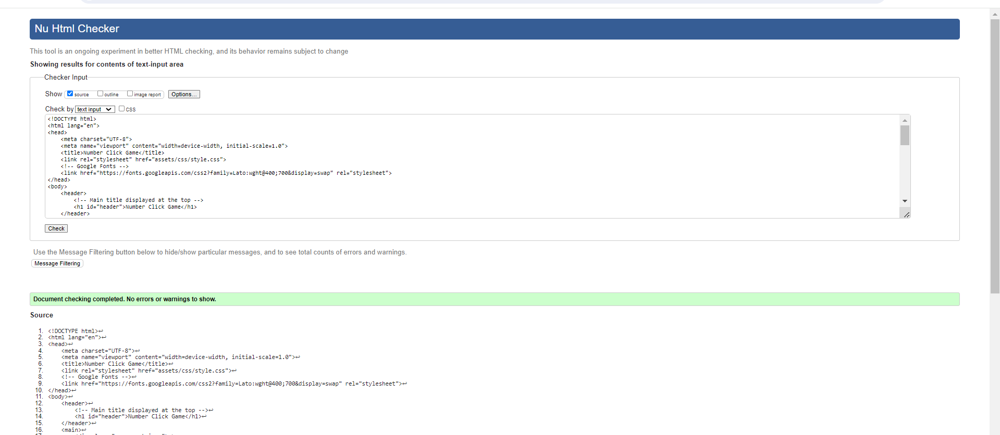

#### CSS
[CSS validator](https://jigsaw.w3.org/css-validator/)

- 0 errors
- 0 warnings

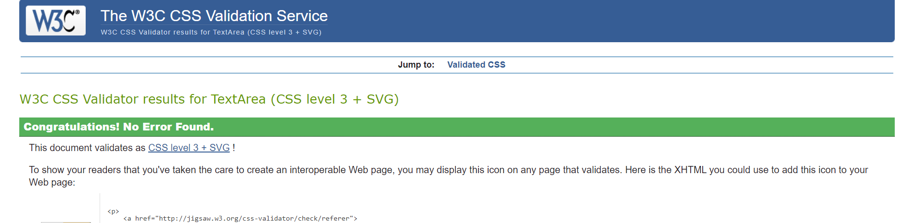

#### JavaScript
[JS Hint](https://jshint.com/)
- 0 errors
- 0 warnings

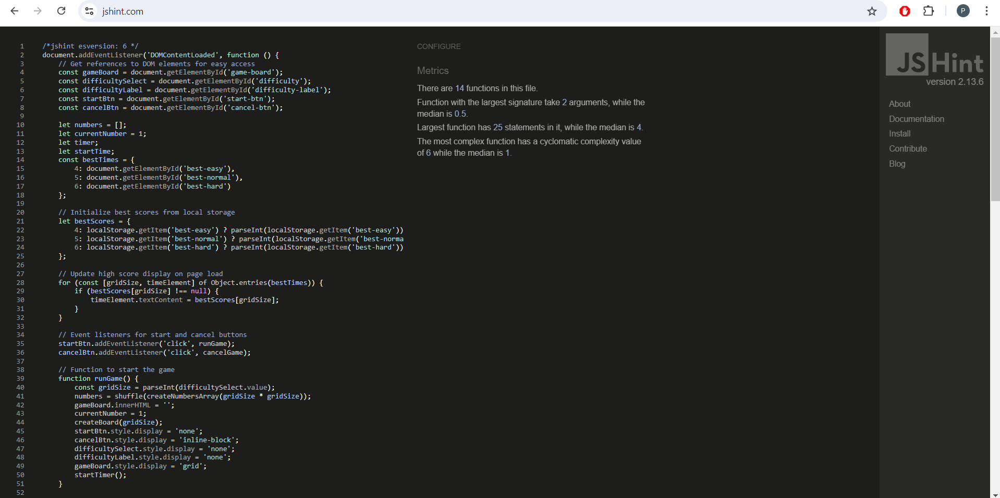

#### Accessibility (Chrome Lighthouse)
**Desktop**:
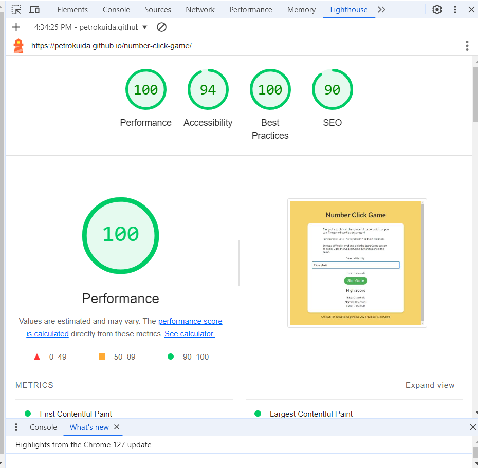

**Mobile**:
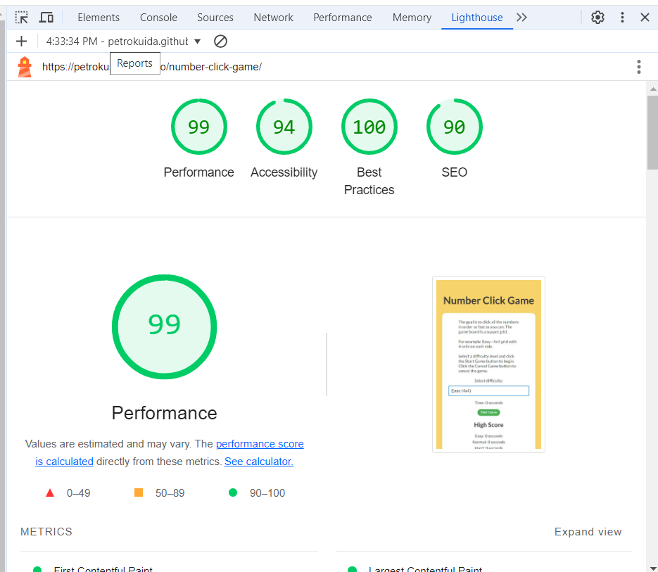

## Deployment
- The site was deployed to GitHub Pages. The steps to deploy are as follows:
  - In the GitHub repository, navigate to the Settings tab.
  - From the source section drop-down menu, select the Main Branch.
  - Once the main branch has been selected, the page will automatically refresh with a detailed ribbon display to indicate the successful deployment.

### Cloning
1. From the repository, click **Code**.
2. Copy the clone URL.
3. Run the following command:
    ```bash
    git clone https://github.com/PetroKuida/number-click-game.git
    ```

### Forking
1. From the repository, click **Fork**.
2. Name your forked repository.
3. Click **Create fork**.

## Credits

### Text
- Text content was generated with the assistance of ChatGPT.

### Fonts
- Google Fonts: Lato
